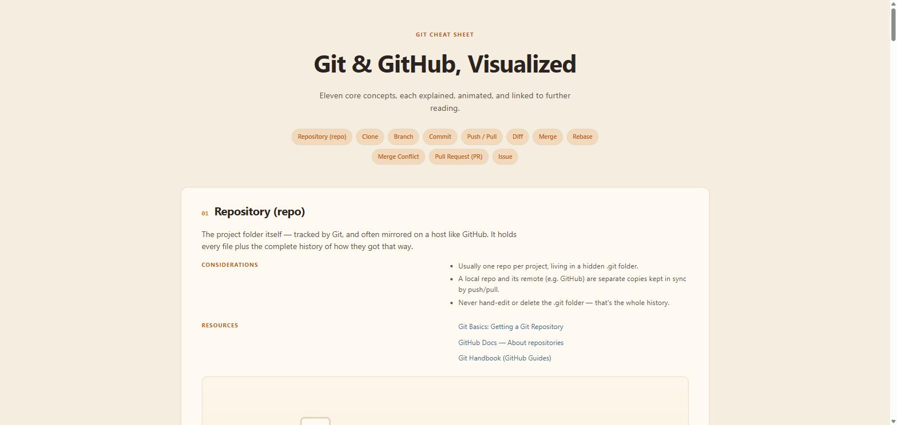

# Git & GitHub, Visualized

An interactive, single-page cheat sheet that explains eleven core Git and GitHub concepts through short descriptions, key considerations, curated further-reading links, and an animated SVG diagram for each one.



## Concepts covered

1. Repository (repo)
2. Clone
3. Branch
4. Commit
5. Push / Pull
6. Diff
7. Merge
8. Rebase
9. Merge Conflict
10. Pull Request (PR)
11. Issue

Each concept has a **Replay** button to re-run its diagram animation.

## Tech stack

- Plain HTML, CSS, and vanilla JavaScript — no build step or framework
- [GSAP](https://gsap.com/) (loaded via CDN) for the SVG diagram animations
- Content and diagram markup for every concept live in `data.js`; `script.js` renders the page and drives the animations

## Project structure

```
index.html   Page shell and table of contents
data.js      Concept content (title, description, considerations, resources, SVG diagram)
script.js    Renders concepts from data.js and animates each diagram
style.css    Styling
```

## Running locally

No dependencies or build tools are required. Just open `index.html` in a browser, or serve the folder with any static server, e.g.:

```
npx serve .
```

## Contributing

This is a personal learning/reference project, but suggestions and corrections are welcome via issues or pull requests.
